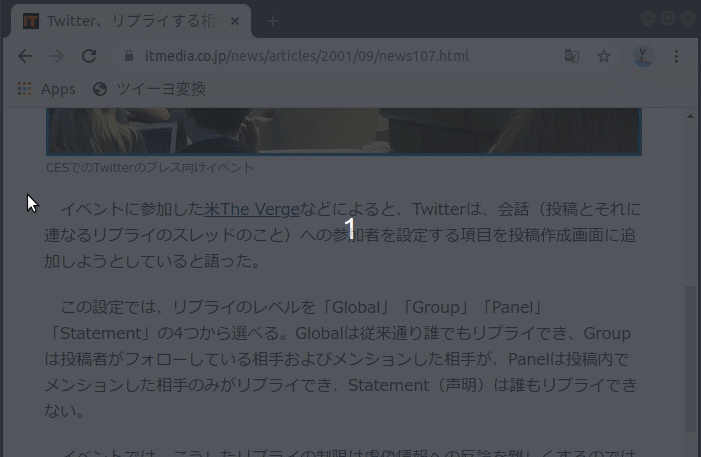
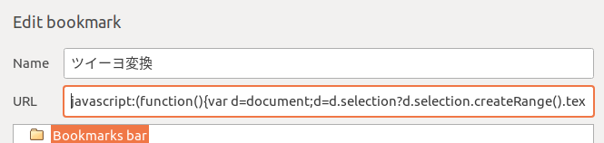

# ツイーヨ変換 ブックマークレット

選択された文字列中に含まれるカタカナの単語を「ツイーヨ」のように変換するブックマークレットです。

## 使い方

1. 以下の文字列をブックマークのURLとして登録します。

``javascript:(function(){var d=document;d=d.selection?d.selection.createRange().text:d.getSelection().toString();console.log(d);prompt("Result:",function(e){function g(a){return a.match(/^[\u30a1-\u30f6\u30fc]+$/)?!0:!1}var h=[{from:"\u30d5\u30a9",to:"\u30d2\u30e7",tail:!1},{from:"\u30e9",to:"\u30e4",tail:!1},{from:"\u30eb",to:"\u30e6",tail:!1},{from:"\u30c8",to:"\u30e8",tail:!1},{from:"\u30c9",to:"\u30e8",tail:!1},{from:"\u30ed",to:"\u30e8",tail:!1}],k=h.map(function(a){return a.from}).join("|"),l=new Map(h.map(function(a){return[a.from,a]}));return e.replace(new RegExp("("+k+")","g"),function(a,f,b){f=l.get(a);b+=a.length;var c;if(c=f.tail){--b;c=e.length;if(b>=c)throw Error("Illegal index");c=!(b===c-1||b===c-2&&"\u30fc"===e[c-1]||!g(e[b+1])||"\u30fc"===e[b+1]&&!g(e[b+2]))}return c?a:f.to})}(d))})();``

2. Webページ上のテキストを選択し、登録したブックマークをクリックします。

## 変換規則

カタカナを以下のように変換します。

* フォ → ヒョ
* ラ → ヤ
* ル → ユ
* ト → ヨ
* ド → ヨ
* ロ → ヨ

一応単語の最後の文字だけ変換する機能がありますが、使っていません。

参考: [ツイーヨ・フォヨー・アイパッヨの考察 (togetter)](https://togetter.com/li/532043)

## ブックマークレットの修正/カスタマイズ方法

1. ``conv.js``を変更します。
2. Googleの[the Closure Compiler](https://developers.google.com/closure/compiler/docs/gettingstarted_ui)でコンパイルします。

参考: https://qiita.com/kanaxx/items/d5a0591336cc2cc55783
